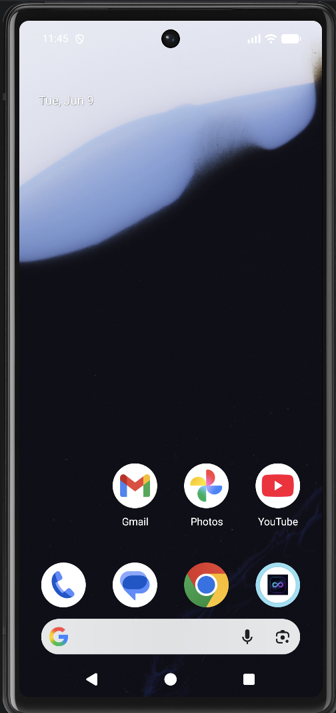
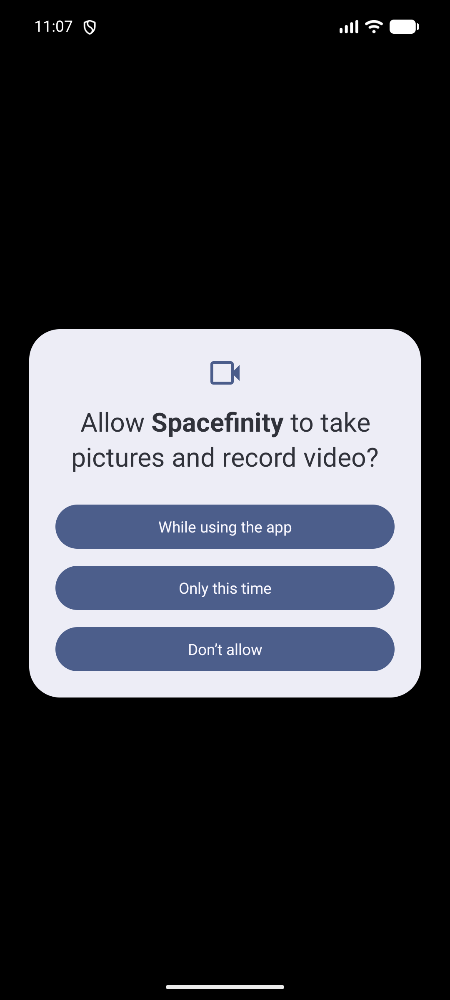
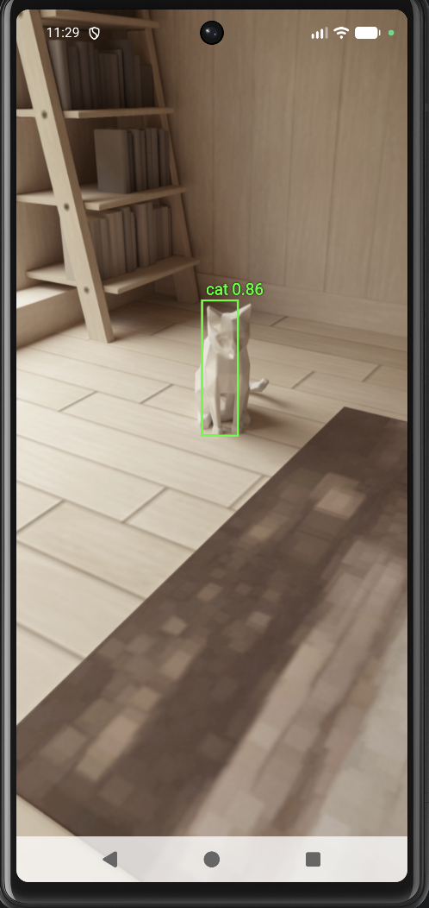
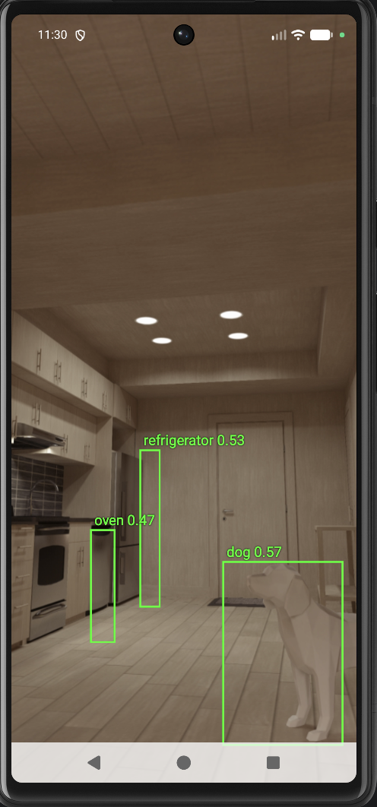

# Object Detector Android YOLO (Spacefinity)

A real-time object detection Android application using the YOLOv8 Nano model via ONNX Runtime and CameraX.

---

## 🚀 Meet Spacefinity & Its Custom Logo

The application is branded as **Spacefinity**. It features a custom logo: a sleek infinity loop representation on a dark cosmic background. The loop represents the infinite loop of live frames processed in real-time by the neural network.

Here is the app successfully compiled and installed, displaying its custom logo on the emulator home screen:

---

## Architecture Fixes & Updates

We resolved two critical launch blocks that were preventing the application from running on modern Android 15 emulators:
1. **AppCompat Theme Resolution**: Fixed the `IllegalStateException` crash by defining a local `AppTheme` style in [themes.xml](file:///Users/bipin/Downloads/object-detector-android-yolo/app/src/main/res/values/themes.xml) that inherits from `Theme.AppCompat.Light.NoActionBar` and referencing it properly in the manifest.
2. **16KB Page Size Compatibility**: Updated the ONNX Runtime dependency to version `1.22.0` and CameraX version to `1.4.0` in [build.gradle.kts](file:///Users/bipin/Downloads/object-detector-android-yolo/app/build.gradle.kts) to ensure native `.so` files are compiled with 16KB page-alignment boundaries.
3. **80-Class COCO Labels**: Configured [labels.txt](file:///Users/bipin/Downloads/object-detector-android-yolo/app/src/main/assets/labels.txt) with the full set of standard COCO classes (cat, dog, tv, etc.) to support proper labeling of all detected objects instead of generic class indexes.

---

## Validation Evidence

### 1. Spacefinity App Permission Screen
Successfully started the application and requested camera permission:

### 2. Cat Detection in Emulator (Living Room)
Successfully detected the virtual cat model on the rug:

### 3. Multi-Object Detection in Emulator (Kitchen)
Successfully detected the virtual dog, refrigerator, and oven in the kitchen area:

